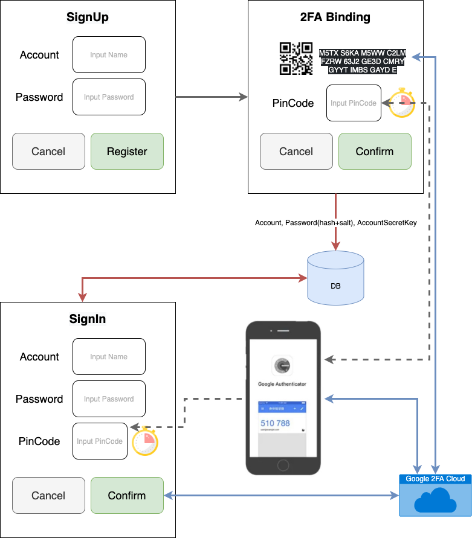

# Google 2FA with ASP.NET Core

## HLD

## Sample UI

## Test With PostMan

import `Lab.TwoFA.postman_collection.json`

- GenerateSetupCode

  取得裝置設定碼, 格式參考 [google-authenticator:Key Uri Format](https://github.com/google/google-authenticator/wiki/Key-Uri-Format)

  `otpauth://TYPE/LABEL?PARAMETERS`

- GetCurrentPin

  取得當前有效的 PinCode

- ValidatePin

  驗證傳入的 PinCode 是否有效

## Data schema

User

- id(`pk, auto`)
- account(`unique key`)
- password(`hash`+`salt`)
- accountSecretKey(`one time generate only`)

## References

- [Two Factor Authentication in ASP.NET CORE](https://www.youtube.com/watch?v=Q-FMEL9KoEs)
- [ASP.NET Core 3.1 - 2FA Without Identity](https://kenhaggerty.com/articles/article/aspnet-core-31-2fa-without-identity)
- [ASP.NET Core Identity Series – Two Factor Authentication](https://chsakell.com/2019/08/18/asp-net-core-identity-series-two-factor-authentication/)